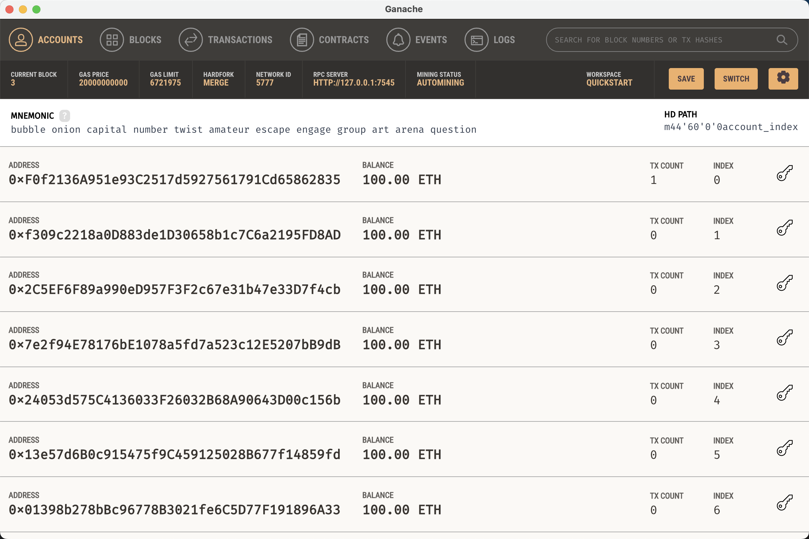
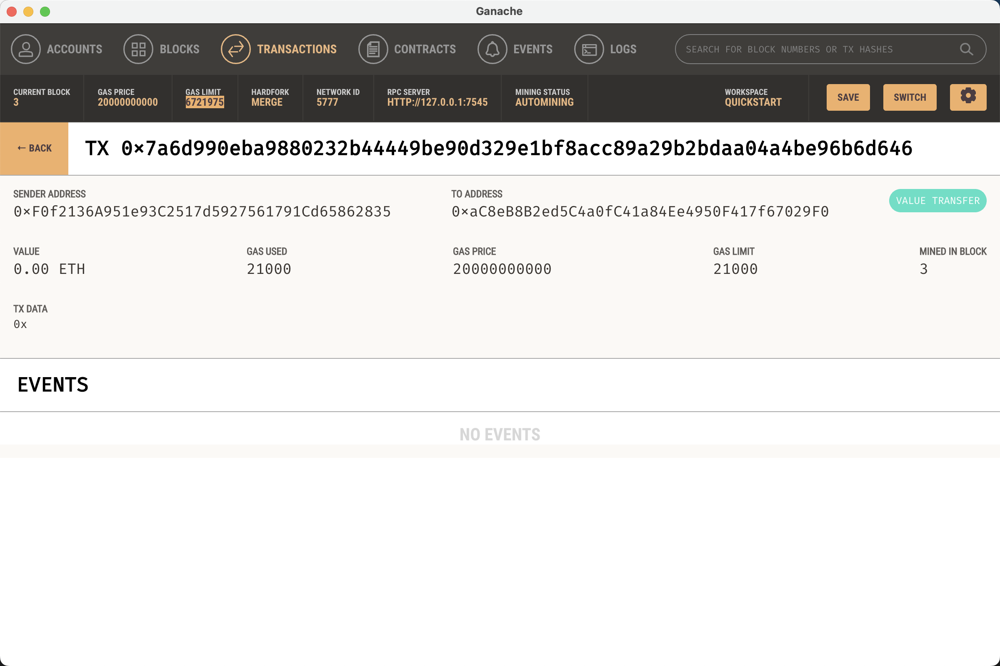

# Module19Challenge

# KryptoJobs2Go - Ethereum Transaction Application

KryptoJobs2Go is a web application built with Streamlit that allows users to send Ethereum transactions to hire candidates. Users can select a candidate, specify the number of hours they want to hire the candidate for, and send the transaction. The application communicates with a local Ethereum blockchain provided by Ganache.

## Features

- **Candidate Selection**: Users can select a candidate from the provided list.
- **Wage Specification**: Users can specify how many hours they wish to hire the candidate.
- **Ethereum Transaction**: With the click of a button, the wage is calculated and a transaction is sent to the Ethereum blockchain.

## Screenshots

### Account Details

### Transaction Details
